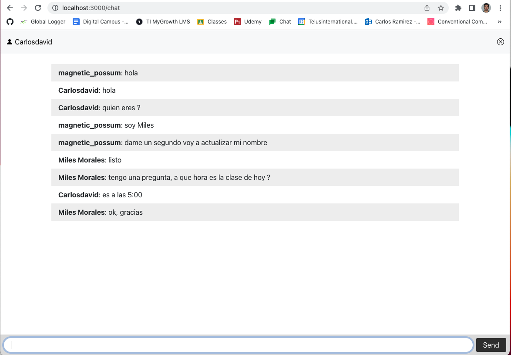

# Chat App 
Chat with NodeJS, Express, Swagger and Jest

## Architecture 

## Home 

## Chat 
You can access the chat from the main page and you can choose the username with which you want to enter

If you enter from the /chat route you will be assigned a random username but you can change it whenever you want

## Change user name 
To change the username, just click on the user's name, an input will be displayed to put the new name

## Api Docks

## Socket connetions logs

## Test with Jest

## New
